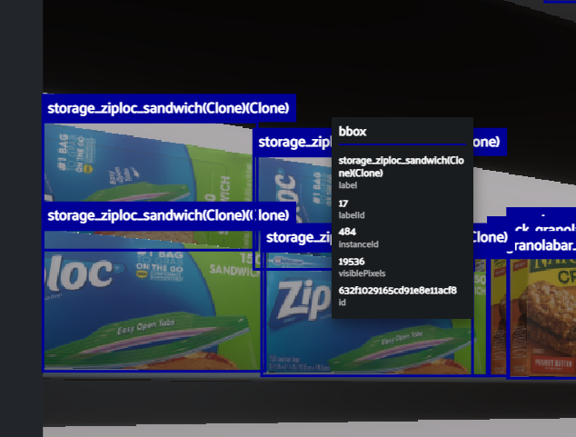
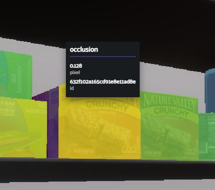

<div align="center">
<p align="center">

**Fiftyone viewer for SOLO Datasets**
---
[](https://github.com/Unity-Technologies/pysolotools/actions)
[](LICENSE)
</p>
</div>

<figure align="center">
    
    <figcaption align="center">Fig. 1 - Screenshot of the example solo dataset displayed in Voxel51</figcaption>
</figure>

## Introduction

pysolotools-fiftyone is a python package for viewing and interacting with solo datasets using the [Voxel51](https://voxel51.com/) viewer.

This package allows the user to create a new Voxel51 viewer in either a web browser or jupyter notebook.

SOLO datasets are generated by Unity's Computer Vision offering [Perception](https://github.com/Unity-Technologies/perception). Please see [here](https://github.com/Unity-Technologies/perception/blob/main/com.unity.perception/com.unity.perception/Documentation~/Schema/SoloSchema.md) for more information about the SOLO schema.

It supports the displaying of the following annotations:
- Bounding Boxes
- 3D Bounding Boxes
- Keypoints
- Instance Segmentation
- Semantic Segmentation
- Depth
- Occlusion
- Normals
- Pixel Position

## Pre-Requisites
- Install [Anaconda](https://docs.anaconda.com/anaconda/install/) or [Miniconda](https://docs.conda.io/en/latest/miniconda.html) (recommended). 
- Install [pre-commit](https://pre-commit.com/).
- Install [OpenEXR](https://www.openexr.com/).
- Make sure `pip` is installed

## Installation

```shell
pip install pysolotools-fiftyone --index-url=https://artifactory.prd.it.unity3d.com/artifactory/api/pypi/pypi/simple
```

** The package lives in the internal Unity PyPi repo for now.

## Execution
The Solo Fiftyone viewer is executed on the command line with the following command line:
```shell
pysolotools-solo_fiftyone ../examples/solo_10_all_labelers
```

This will launch a new fiftyone viewer in your web browser.

## Annotation Types
### Bounding Boxes
2D bounding boxes and label type for each visible labeled object in the image. Detailed information includes the amount
of visible pixels of the object.
<p align="center">

    <br><i>Bounding boxes in Voxel51</i>
<br><br>



    <br><i>Bounding box detail information</i>
</p>

### Semantic Segmentation
Semantic segmentation labels each pixel of an image with a label type.
<figure align="center">
    
    <figcaption align="center">Fig. 4 - Semantic segmentation in Voxel51</figcaption>
</figure>

### Instance Segmentation


Each pixel of the image is labeled with the ID of the object that it represents.  


### Keypoints

<figure align="center">
    
    <figcaption align="center">Fig. 6 - Screenshot of the example solo dataset displayed in Voxel51</figcaption>
</figure>

### 3D Bounding Boxes
3D volume of object in the scene.
<figure align="center">
    
    <figcaption align="center">Fig. 7 - 3D bounding boxes in Voxel51</figcaption>
</figure>

### Depth
Pixel distance from the camera in the scene displayed in [Plotly's virdis scale](https://plotly.com/python/builtin-colorscales/). The color scale goes from purple to 
yellow, with purple representing objects closer to the camera.
<figure align="center">
    
    <figcaption align="center">Fig. 8 - Depth image in Voxel51, purple pixels are closer to the camera, yellow pixels are farthest away</figcaption>
</figure>

### Occlusion
Object occlusion, or the amount of the object you can see, displayed in [Plotly's virdis scale](https://plotly.com/python/builtin-colorscales/). The scale goes from yellow (fully visible) to purple (fully occluded). 
Hovering over a pixel will give you the exact occlusion value.
<figure align="center">
    
    <figcaption align="center">Fig. 9 - Occlusion in Voxel51, yellow is fully visible, purple is fully occluded</figcaption>
</figure>
<figure align="center">
    
    <figcaption align="center">Fig. 10 - Exact occlusion value for an object</figcaption>
</figure>

### Normals
The normals image displays an object's surface normal in a 3 channel image. The red channel represents the normal's x value,
the green channel represents the y channel, and the blue channel represents the normal's z value.
<figure align="center">
    
    <figcaption align="center">Fig. 11 - Normals in Voxel51</figcaption>
</figure>

### Pixel Position
The pixel position image displays a pixels cartesian coordinate in the camera's space. The red channel represents the pixel position's x value,
the green channel represents the y channel, and the blue channel represents the z value. The image displayed is a 8bit per channel representation
of a 32bit per channel file format, so some accuracy is lost in the display.
<figure align="center">
    
    <figcaption align="center">Fig. 12 - Pixel position in Voxel51</figcaption>
</figure>


## Additional Resources

## Community and Feedback

The Unity Computer Vision demos are open-source and we encourage and welcome contributions.
If you wish to contribute, be sure to review our [contribution guidelines](CONTRIBUTING.md)
and [code of conduct](CODE_OF_CONDUCT.md).

## Support

For feature requests, bugs, or other issues, please file a
[GitHub issue](https://github.com/Unity-Technologies/Unity-Vision-Hub/issues)
using the provided templates we will investigate as soon as possible.

## License
[Apache License 2.0](LICENSE)

## Know Issues
When running with a web browser, it will open with a subset of your frames visible.
The data is still being imported in the background, and refreshing the browser will
update the viewer will the current set of loaded scenes.
