<div align="center">
<p align="center">

**Fiftyone viewer for SOLO Datasets**
---
[](https://github.com/Unity-Technologies/pysolotools/actions)
[](LICENSE)
</p>
</div>

<p align="center">
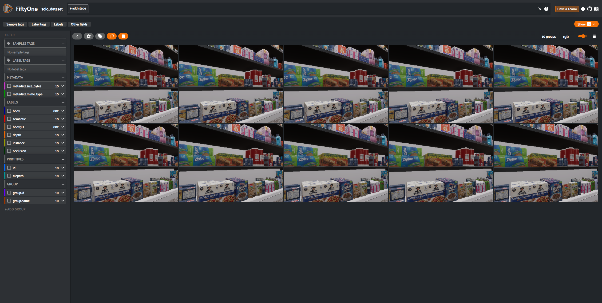
    <br><i>Screenshot of the example solo dataset displayed in Voxel51</i><br>
</p>

# Introduction

pysolotools-fiftyone is a python package for viewing and interacting with solo datasets using the [Voxel51](https://voxel51.com/) viewer.

This package allows the user to create a new Voxel51 viewer in either a web browser or jupyter notebook.

SOLO datasets are generated by Unity's [Perception package](https://github.com/Unity-Technologies/perception). Please see [here](https://github.com/Unity-Technologies/perception/blob/main/com.unity.perception/com.unity.perception/Documentation~/Schema/SoloSchema.md) for more information about the SOLO schema.

It supports the displaying of the following annotations:
- Bounding Boxes
- 3D Bounding Boxes
- Keypoints
- Instance Segmentation
- Semantic Segmentation
- Depth
- Occlusion
- Normals
- Pixel Position

# Pre-Requisites
- Install [Anaconda](https://docs.anaconda.com/anaconda/install/) or [Miniconda](https://docs.conda.io/en/latest/miniconda.html) (recommended).
- Install [pre-commit](https://pre-commit.com/).
- Install [OpenEXR](https://www.openexr.com/).
- Make sure `pip` is installed

# Installation

```shell
pip install pysolotools-fiftyone
```

# Execution

## CLI
The Solo Fiftyone viewer is executed on the command line with the following command line:
```shell
pysolotools-fiftyone examples/groceries
```

This will launch a new fiftyone viewer in your web browser.

## Notebooks
SOLO FiftyOne can be executed in [Jupyter Notebooks](https://jupyter.org/).

To use in a notebook:
```shell
from pysolotools_fiftyone.solo_fiftyone import run_in_notebook

path="./groceries"
run_in_notebook(path)
```

An [example notebook](examples/groceries_notebook.ipynb) has been included in the repository for your convenience.

The fiftyone will create an entry for each frame. Each entry will consist of a group with at least an RGB capture of the
Unity game screen. If the dataset was created with Normals or Pixel Position labelers, the image group will also contain
a PNG image for each one of them. These 3 types create the background of the frame, and the *labels* are drawn on to of
them. The background image can be changed with the *group* dropdown located at the upper right of the screen.
<p align="center">
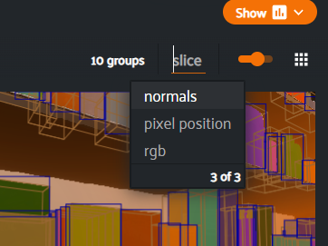
    <br><i>Group dropdown</i><br>
</p>

Labels are drawn on top of the background group image. These can be toggled on and off via the *Labels* selector left
of the image.
<p align="center">
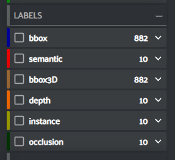
    <br><i>Label selector</i><br>
</p>

# Annotation Types
## Bounding Boxes
2D bounding boxes and label type for each visible labeled object in the image. Detailed information includes the amount
of visible pixels of the object.
<p align="center">
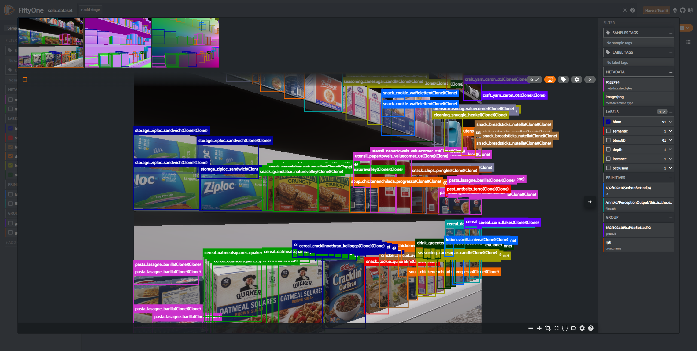
    <br><i>Bounding boxes in Voxel51</i><br>
</p>

## Semantic Segmentation
Semantic segmentation labels each pixel of an image with a label type.
<p align="center">
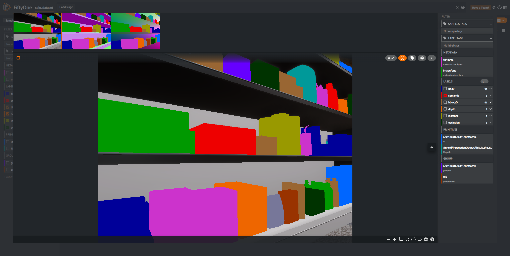
    <br><i>Semantic segmentation in Voxel51</i><br>
</p>

## Instance Segmentation
Each pixel of the image is labeled with the ID of the object that it represents.
<p align="center">
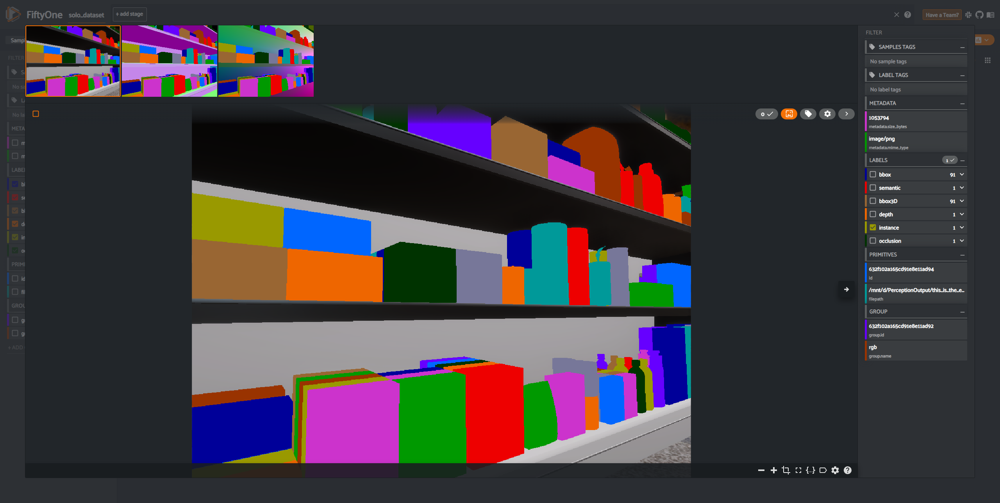
    <br><i>Instance segmentation in Voxel51</i><br>
</p>

## Keypoints
Display keypoint (generally, but not limited to, a human skeleton) information.
<p align="center">
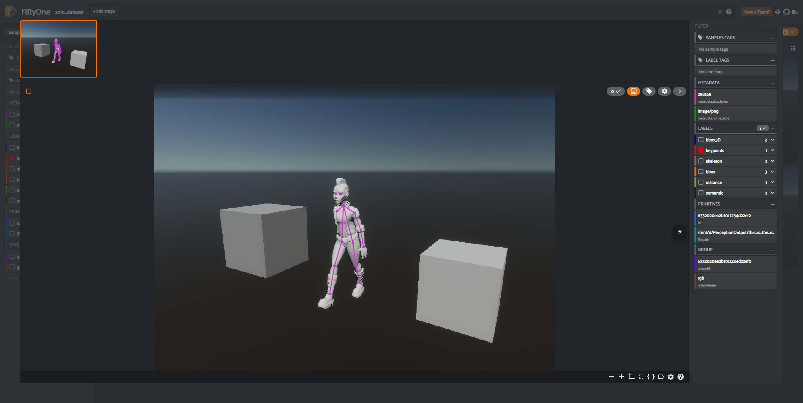
    <br><i>Keypoints in Voxel51</i><br>
</p>

## 3D Bounding Boxes
3D volume of object in the scene.
<p align="center">
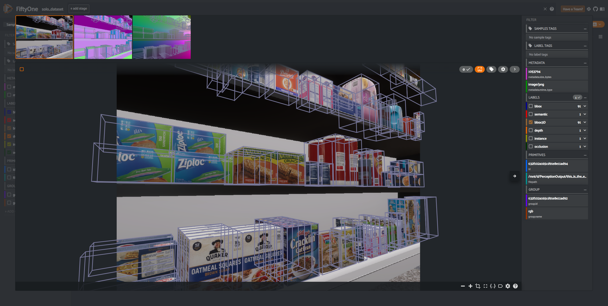
    <br><i>3D Bounding Boxes in Voxel51</i><br>
</p>

## Depth
Pixel distance from the camera in the scene displayed in [Plotly's virdis scale](https://plotly.com/python/builtin-colorscales/). The color scale goes from purple to
yellow, with purple representing objects closer to the camera.
<p align="center">
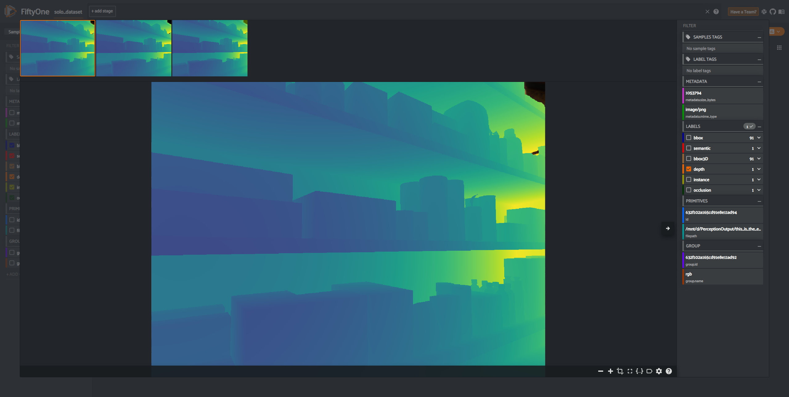
    <br><i>Depth image in Voxel51, purple pixels are closer to the camera, yellow pixels are farthest away</i><br>
</p>

## Occlusion
Object occlusion, or the amount of the object you can see, displayed in [Plotly's virdis scale](https://plotly.com/python/builtin-colorscales/). The scale goes from yellow (fully visible) to purple (fully occluded).
Hovering over a pixel will give you the exact occlusion value.
<p align="center">
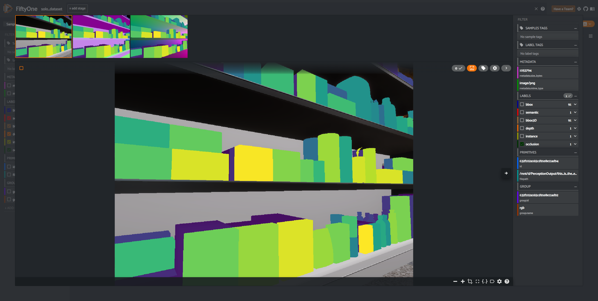
    <br><i>Occlusion in Voxel51, yellow is fully visible, purple is fully occluded</i><br>
</p>

## Normals
The normals image displays an object's surface normal in a 3 channel image. The red channel represents the normal's x value,
the green channel represents the y channel, and the blue channel represents the normal's z value.
<p align="center">
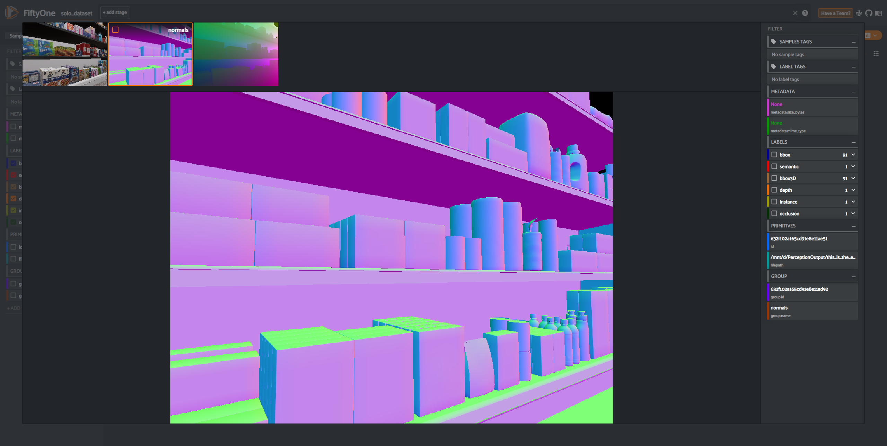
    <br><i>Normals in Voxel51</i><br>
</p>

## Pixel Position
The pixel position image displays a pixels cartesian coordinate in the camera's space. The red channel represents the pixel position's x value,
the green channel represents the y channel, and the blue channel represents the z value. The image displayed is a 8bit per channel representation
of a 32bit per channel file format, so some accuracy is lost in the display.
<p align="center">
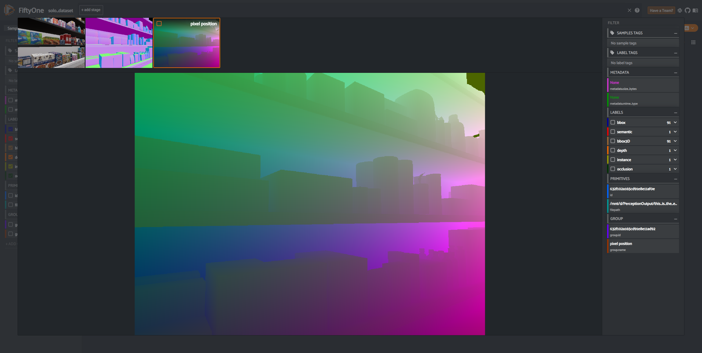
    <br><i>Pixel Position in Voxel51</i><br>
</p>

# Sample SOLO Datasets
Inside the `examples` directory there are two sample datasets
- groceries: A dataset of grocery items that have all supported labels except keypoints
- keypoints: A simple dataset that has keypoint annotations


# Community and Feedback

The Unity Computer Vision tools are open-source, and we encourage and welcome contributions.
If you wish to contribute, be sure to review our [contribution guidelines](CONTRIBUTING.md)
and [code of conduct](CODE_OF_CONDUCT.md).

# Support

For feature requests, bugs, or other issues, please file a
[GitHub issue](https://github.com/Unity-Technologies/pysolotools-fiftyone/issues)
using the provided templates we will investigate as soon as possible.

# License
[Apache License 2.0](LICENSE.md)

# Know Issues
- When running with a web browser, it will open with a subset of your frames visible.
The data is still being imported in the background, and refreshing the browser will
update the viewer will the current set of loaded scenes.
- To properly see some heatmap overlays (for instance depth and occlusion) make sure that you have Voxel51 settings (gear icon at the top of the screen) fields ***Color by*** set to **label** and ***Label opacity*** to highest (all of the way to the right)
<p align="center">
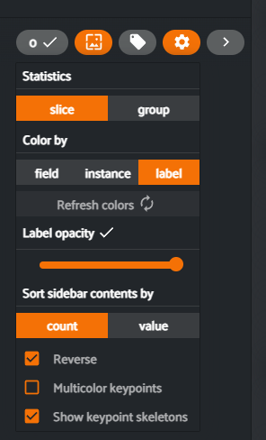
</p>
